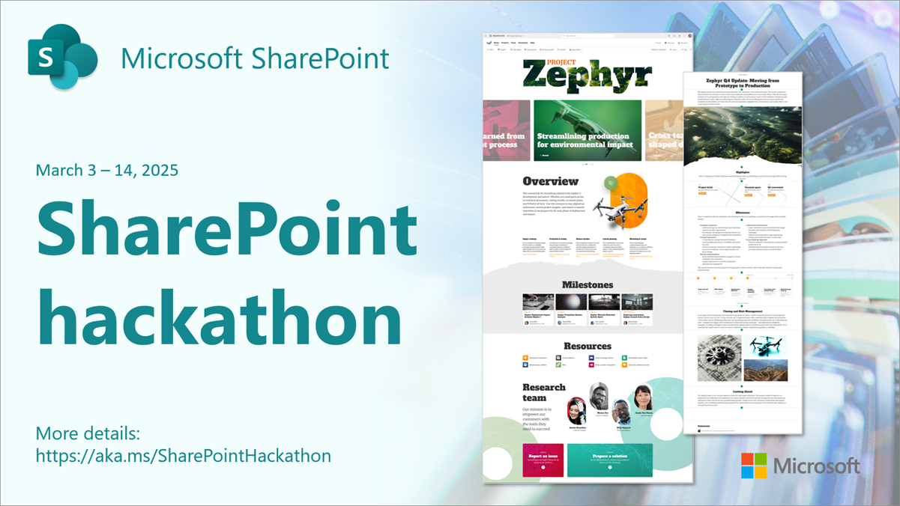

# SharePoint Hackathon - Building beautiful and engaging experiences with SharePoint

✨ **Design, Create and Share!** ✨

We are excited to invite you to a **hackathon** dedicated to **crafting exceptional employee experiences using AI and the latest SharePoint features**! 💡

SharePoint is a powerful platform for creating **engaging and dynamic experiences for employees**. With new UX-focused features and innovative SharePoint Agents, SharePoint is more relevant than ever. Tens of millions of end users are leveraging custom experiences built with the SharePoint Framework (SPFx) each month with custom SharePoint portal experiences.

👋 **This hackathon is open to everyone!** Whether you're an end user, designer, architect, or developer, there's a place for you. The SharePoint Hackathon will showcase the diverse possibilities within the SharePoint ecosystem. 

Submission categories include:

- Solutions incorporating SharePoint Agents
- Designs utilizing out-of-the-box features
- Viva Connections Dashboard experiences
- Extensible experiences with SPFx

If you've created a SharePoint site and tailored it to meet your business needs, you're all set to participate! The possibilities are endless for what you can create... plus, you can submit your hack for a chance to win exciting prizes! 🥳

**SharePoint Hackathon runs from March 3rd to March 17th**. Hack submissions are due March 17th, 11:59 PM PST. Join us! 🧑‍🤝‍🧑

## Register

**Register for the hackathon** using any of the sessions linked on the [Reactor Series page](https://developer.microsoft.com/en-us/reactor/series/S-1480/). This will register you for both the selected live stream session and the actual hackathon.

Introduce yourself and get familiar with other attendees on [GitHub Discussions in this repository](https://github.com/SharePoint/sharepoint-hackathon/discussions/2) 🙋‍♂️🙋‍♀️

## Official Rules

Read the [official rules](https://github.com/SharePoint/sharepoint-hackathon/blob/main/OFFICIAL_RULES.md) 📃

## Stream Schedule

Stream will be hosted at the [Microsoft Community Learning YouTube channel](https://aka.ms/community/youtube).

### Week 1: March 3rd - 7th

| Day/Time              | Topic                    |
| --------------------- | ------------------------ |
| 3/3, 04:00 PM UTC / 09:00 AM PT | [Kickoff to Innovation: SharePoint Hackathon Launch](https://www.youtube.com/live/XtpB1bEH5oo) |
| 3/5, 04:00 PM UTC / 09:00 AM PT | [Building Beautiful SharePoint Portals: Latest Features in Action](https://www.youtube.com/live/0Lf66EUEieE) |
| 3/6, 04:00 PM UTC / 09:00 AM PT | [Unlocking Efficiency: SharePoint Agents in Action](https://www.youtube.com/live/bQ4wsx-6mms) |

### Week 2: March 10th-14th

| Day/Time              | Topic                    |
| --------------------- | ------------------------ |
| 3/10, 04:00 PM UTC / 09:00 AM PT | [Transforming Employee Experiences with Stunning Dashboards in Viva Connections](https://www.youtube.com/live/xI-V-BG5OCs) |
| 3/12, 04:00 PM UTC / 09:00 AM PT | [Using SharePoint Framework (SPFx) to elevate SharePoint portal UX](https://www.youtube.com/live/3U-pKN0-ikc) |

### Announcing winners: March 26th

| Day/Time              | Topic                    |
| --------------------- | ------------------------ |
| 3/26, 04:00 PM UTC / 09:00 AM PT | [Celebrating Creativity: SharePoint Hackathon Awards Ceremony](https://www.youtube.com/live/lnO8gsIO2Zk) |

## Office Hours

For additional help with your hacks, you can drop by Office Hours. The Official Office Hours schedule will be posted in mid-February.

## Project Submission

Submissions are due Monday March 17th, 11:59 PM PST.
Submit your project here in GitHub Issues when it's ready🚀
**🚀 [Project Submission Form](https://aka.ms/SharePoint/Hackathon/ProjectSubmission)**

Check out this video for step by step project submission guidance:
**[Project Submission Video](https://github.com/microsoft/hack-together-teams/assets/3199282/572ea387-61ec-4b77-9885-23b5b2bd39bd)**

## Prizes and Categories 🏅

Projects will be evaluated by a panel of judges, including Microsoft engineers, product managers, and developer advocates. Judging criteria will include innovation, impact, technical usability, and alignment with corresponding hackathon category.

Final prices will be confirmed by mid-February 2025.

Hackathon has four different categories. The winner will be announced for all these four categories.

* **Most creative use of SharePoint Agents** - Demonstration of SharePoint agent use case on the different kinds of materials and source files which can be used for the agents.
* **Most beautiful Intranet home page** - Beautiful design in SharePoint with out-of-the-box features like flexible layouts, Editorial Card web part etc.
* **Most useful Viva Connections dashboard** - Viva Connection dashboard design for specific company with creative card layouts and features. It can include customizations like card designer, Power Cards and SPFx.
* **Most creative intranet with extensibility (SPFx)** - Custom SharePoint portal experience with SharePoint Framework (SPFx). Extra points on including AI scenario(s).

All hackathon participants who submit a project will receive a digital badge. To receive the digital badge, all participants must submit this form: **[Badge Submission Form](https://aka.ms/SharePoint/Hackathon/Badges)** by March 17th, 11:59PM PST. The GitHub handle must match the handle submitted in the Project Submission Form.

## Frequently asked questions (FAQ) 🙋‍♂️🙋‍♀️

**Do I need to be a developer for this hackathon?**

No. Anyone can create beautiful looking pages in SharePoint or use the SharePoint agents to increase their productivity. Anyone can submit their work for the competition.

**We have a product build for/with SharePoint - can we submit?**

Yes. Anyone can submit to this hackathon. If you are a partner who has created an intranet-in-a-box offering, you can also submit your design or agent scenarios for this hackathon.

**What will be expected from the submissions?**

There are two important things to do for each submissions:

1. Register (available soon)
1. Submit an issue with link to the video which demonstrates your submission

**We have a cool SharePoint design on our intranet, can I submit that?**

Yes as long as you have permission from your company or the service owner to do that. We are excited to see what kind of use cases you have with SharePoint Agents and what kind of designs our customers and partners have created with SharePoint and Viva Connections.

**How should I create the video for submission?**

There are multiple ways to do this. Key is to showcase the design and features you have in your deployment. You can use whatever software you like for recording and then submit the entry to us in a location which can be accessed. This could mean attaching video on the submission entry, video in YouTube (can be unlisted if link works) or by sharing a video with file sharing services, like with OneDrive.

Got other questions? - Please use the [Discussions section in the repository](https://github.com/SharePoint/sharepoint-hackathon/discussions). We are here to help and answer all your questions.