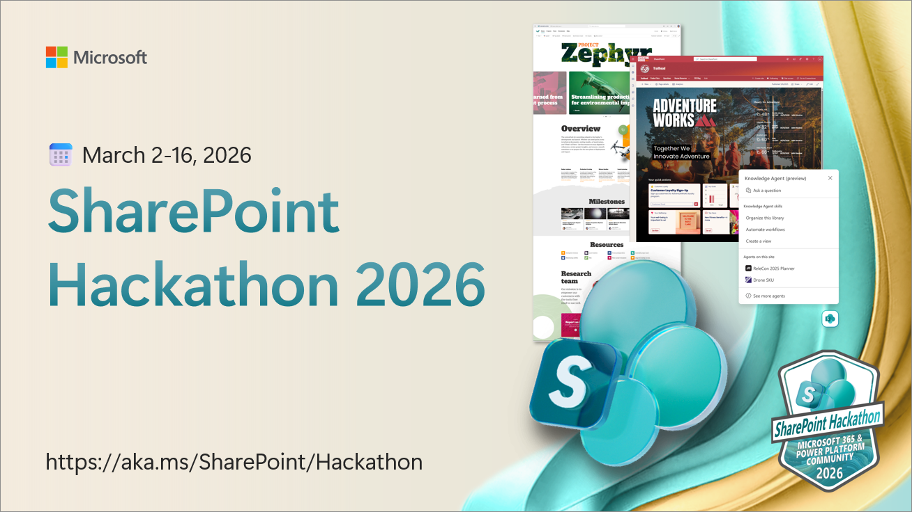
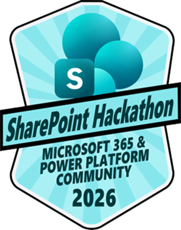

# SharePoint Hackathon - Building beautiful and engaging experiences with SharePoint

We are excited to share the SharePoint Hackathon will be back on 2026! Initial details shared already below and more details on the awards coming soon!

We truly enjoyed this event in 2025 and are looking forward to working with you all again in 2026 🙏🤩

## SharePoint Hackathon 2026 details

✨ **Design, Create and Share!** ✨

We are excited to invite you to a **hackathon** dedicated to **crafting engaging experiences using AI and the latest SharePoint features**! 💡

**SharePoint is the knowledge platform for Copilot and agents**. It brings together powerful new features for building visually rich, engaging experiences while infusing sites and content with the latest AI‑powered capabilities. As the knowledge platform for Microsoft 365, SharePoint provides the structured, governed fabric that Copilot agents rely on to access and reason over organizational content.

SharePoint’s extensibility platform spans low‑code customization, the full‑code [SharePoint Framework](https://aka.ms/spfx) (SPFx), and [SharePoint Embedded](https://aka.ms/spe), providing customers and partners with flexible ways to tailor experiences, adapt UI behavior, build custom solutions, and extend AI‑driven scenarios to meet unique business needs.

👋 **This hackathon is open to everyone!** Whether you're an end user, designer, architect, or developer, there's a place for you. The SharePoint Hackathon will showcase the diverse possibilities within the SharePoint ecosystem.

Submission categories include:

* Best organized library using Knowledge Agent
* Best use of custom agents with SharePoint
* Designs utilizing out-of-the-box features
* UX extensible experiences with SPFx
* Integration scenarios with SharePoint Embedded
* and more...

If you've created a SharePoint site and tailored it to meet your business needs, you're all set to participate! The possibilities are endless for what you can create... plus, you can submit your hack for a chance to win exciting prizes! 🥳

**SharePoint Hackathon runs from March 2nd to March 16th**. Hack submissions are due Monday March 16th 2026, 11:59 PM PST. Join us! 🧑‍🤝‍🧑

## Register

We do not require you to pre-register on the hackathon as such. You can though subscribe for reminders on the upcoming live streams. More details on that soon.

Introduce yourself and get familiar with other attendees on [GitHub Discussions in this repository](https://github.com/SharePoint/sharepoint-hackathon/discussions/2) 🙋‍♂️🙋‍♀️

## Official Rules

Read the [official rules](https://github.com/SharePoint/sharepoint-hackathon/blob/main/OFFICIAL_RULES.md) 📃

## Stream Schedule

Stream will be hosted at the [Microsoft Community Learning YouTube channel](https://aka.ms/community/youtube).

### Week 1: March 2nd - 5th

| Day/Time              | Topic                    |
| --------------------- | ------------------------ |
| 3/3, 04:00 PM UTC / 09:00 AM PT | [Kickoff to Innovation: SharePoint Hackathon Launch](https://www.youtube.com/live/XtpB1bEH5oo) |
| 3/5, 04:00 PM UTC / 09:00 AM PT | [Building Beautiful SharePoint Portals: Latest Features in Action](https://www.youtube.com/live/0Lf66EUEieE) |
| 3/6, 04:00 PM UTC / 09:00 AM PT | [Unlocking Efficiency: SharePoint Agents in Action](https://www.youtube.com/live/bQ4wsx-6mms) |

### Week 2: March 9th - 12th

| Day/Time              | Topic                    |
| --------------------- | ------------------------ |
| 3/10, 04:00 PM UTC / 09:00 AM PT | [Transforming Employee Experiences with Stunning Dashboards in Viva Connections](https://www.youtube.com/live/xI-V-BG5OCs) |
| 3/12, 04:00 PM UTC / 09:00 AM PT | [Using SharePoint Framework (SPFx) to elevate SharePoint portal UX](https://www.youtube.com/live/3U-pKN0-ikc) |

### Announcing winners: March 26th

| Day/Time              | Topic                    |
| --------------------- | ------------------------ |
| 3/25, 04:00 PM UTC / 09:00 AM PT | Celebrating Creativity: SharePoint Hackathon 2026 Awards Ceremony |

## Office Hours

For additional help with your planned submission, you can drop by Office Hours where you'll have at least [Vesa Juvonen](https://www.linkedin.com/in/vesajuvonen/) (Microsoft) and [Luise Freese](https://www.linkedin.com/in/luisefreese/) helping with any questions you might have on the hackathon or what you are planning to submit. Office hours are hosted as normal Teams meeting for easy attendance and discussion.

We can provide you step by step guidance on registration to GitHub, submission details or any other questions you might have on the Hackathon.

| Day/Time              | Topic                    |
| --------------------- | ------------------------ |
| 3/04, 07:00 PM UTC / 11:00 AM PT - 30 min | Join details soon |
| 3/06, 02:00 PM UTC / 06:00 AM PT - 30 min | Join details soon |
| 3/09, 11:00 AM UTC / 03:00 AM PT - 30 min | Join details soon |
| 3/11, 07:00 PM UTC / 12:00 AM PT - 30 min | Join details soon |
| 3/13, 03:00 PM UTC / 06:00 AM PT - 30 min | Join details soon |

Notice that as US moves to daylight savings in early March (8th of March), second week of the hackathon timings can be impact your time. Check the schedule based on the UTC time.

## Project Submission

**Submissions are due Monday March 16th 2026, 11:59 PM PST**. Submission should be in video format with potential additional pictures, showing the design or implementation, you've created.

Submit your project here in GitHub Issues when it's ready🚀
**🚀 [Project Submission Form](https://aka.ms/SharePoint/Hackathon/ProjectSubmission)**

Check out this video for step by step project submission guidance:
**[Project Submission Video](https://github.com/microsoft/hack-together-teams/assets/3199282/572ea387-61ec-4b77-9885-23b5b2bd39bd)**

## Categories and Prizes 🏅

Hackathon has seven distinct categories - one submission can be suitable for multiple categories. The winner is announced for all these seven categories.

* **Best design for SharePoint Site** - Recognizes a SharePoint site with outstanding visual design, branding, layout, and usability that delivers a polished and engaging user experience.
* **Best mobile experience design for SharePoint** - Awards a solution that delivers an intuitive, responsive, and high-quality SharePoint experience optimized specifically for mobile devices through Microsoft Teams mobile experiences.
* **Best use of [tbd]** - *Category details cannot yet be shared*
* **Best organized library using Knowledge agent** - Celebrates a document library that leverages a Knowledge agent to improve content organization, discoverability, metadata enrichment, and user understanding.
* **Best use of custom agents with SharePoint** - Honors solutions that integrate custom AI agents with SharePoint to automate tasks, answer questions, provide insights, or enhance collaboration workflows. Focus on custom SharePoint agents, but in general agents which focuses on SharePoint as the source are also welcome.
* **Most innovative SharePoint experience with SPFx** - Recognizes advanced SPFx solutions that integrate Copilot and AI scenarios - Focus on custom web parts, extensions, or experiences that go beyond out-of-the-box capabilities and providing additional AI powered scenarios for end users for example using [Copilot APIs](https://learn.microsoft.com/en-us/microsoft-365-copilot/extensibility/copilot-apis-overview) with custom SPFx solutions.
* **Most innovative solution with SharePoint Embedded** - Awards groundbreaking solutions that embed SharePoint content or services into external applications, enabling seamless content management and collaboration experiences.

All hackathon participants who submit a video on their experiences will receive a digital badge (look and feel might change by the time of the actual Hackathon). To receive the digital badge, all participants must submit this form: **[Badge Submission Form](https://aka.ms/SharePoint/Hackathon/Badges)** by March 16th, 11:59PM PST. The GitHub handle must match the handle submitted in the Project Submission Form.

Projects will be evaluated by a panel of judges, including Microsoft engineers, product managers, and developer advocates. Judging criteria will include innovation, impact, technical usability, and alignment with corresponding hackathon category. One submission can be submitted to multiple categories.

**Prizes** for the winners include the following:

* Final winner prices to be shared in early February 2026 - We are looking to have cool **device based awards** this time  ✨🤩
* The top three submissions in each category will be published in Microsoft credited blog post at the [SharePoint blog](https://aka.ms/sp-blog)

We will be also acknowledging few special categories from the submitted videos - with a special callout in the award celebration blog post and live stream. These special cateories are following:

* Most Creative Video Presentation ✨
* Best Video Presenter Voice 🎤
* Most Enthusiastic Presenter ⚡
* Most Innovative SharePoint Hack 👩‍💻
* Most Artistic SharePoint Visualization 🎨

These are great additional opportunities to get acknowledged on your submission 💡

## Frequently asked questions (FAQ) 🙋‍♂️🙋‍♀️

**Do I need to be a developer for this hackathon?**

No. Anyone can **create beautiful looking pages in SharePoint or use the SharePoint agents** to increase their productivity. Anyone can submit their work for the competition and everyone is awarded with a badge to do so.

**We have a product build for/with SharePoint - can we submit?**

Yes. Anyone can submit to this hackathon. If you are a partner who has created an intranet-in-a-box offering, you can also submit your design or agent scenarios for this hackathon. Any submission which contains SPFx customizations would fall on that specific category and we'll take the submission background also into account in the judging.

Notice that *we are looking into engaging with our SharePoint partner ecosystem* more closely also with specific partner showcase blog posts and interviews. See [example story](https://techcommunity.microsoft.com/blog/spblog/ai-powered-intranet-solution-built-on-sharepoint---fresh-intranet---sharepoint-p/4465709) and volunteer for a story by submitting [this form](https://aka.ms/sharepoint/partner/showcase).

**Do I need to create something new or can I submit video of what we already have?**

You are NOT expected specifically to create any new designs or code during this hackathon, so if you already have a beautiful intranet or are for example using SharePoint Agents in intersting scenarios, those stories are also welcome.

We want everyone to be able to submit their beautiful UX designs, SharePoint Agents stories or SPFx experiences for the competition to showcase the art of possible within SharePoint.

**What will be expected from the submissions?**

There is only two things to do for each submissions:

1. Create a video which showcases what you have created
1. Submit an issue with link to the video which demonstrates your submission - https://aka.ms/SharePoint/hackathon/submission

**We have a cool SharePoint design on our intranet, can I submit that?**

Yes as long as you have permission from your company or the service owner to do that. We are excited to see what kind of use cases you have with SharePoint Agents and what kind of designs our customers and partners have created with SharePoint.

**How should I create the video for submission?**

There are multiple ways to do this. Key is to highlight the design and features you have in your deployment. You can use whatever software you like for recording and then submit the entry to us in a location which can be accessed. This could mean attaching video on the submission entry, video in YouTube (can be unlisted if link works) or by sharing a video with file sharing services, like with OneDrive.

**How many people can be in a team which is building a submission?**

One submission can be from 1-4 people. You can submit as an individual person, or you can join with other community members to build a team with maximum 4 persons in the team.

**Can one submission be for multiple cateogries?**

Yes. When you are submitting the details, you can select the categories which are relevant for your submission. One submission can below to multiple categories. One submission can also win multiple categories, but in that case, only one set of awards are provided for the winnin team.

---

Got other questions? - Please use the [Discussions section in the repository](https://github.com/SharePoint/sharepoint-hackathon/discussions). We are here to help and answer all your questions.
